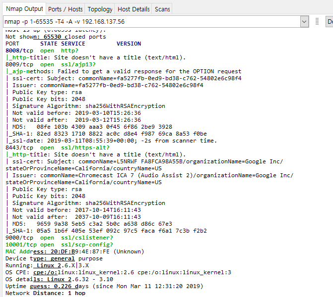
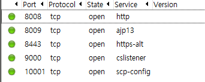
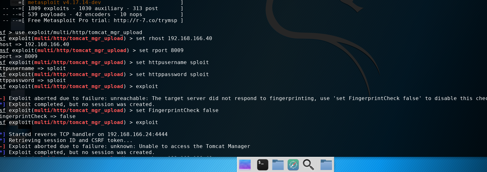
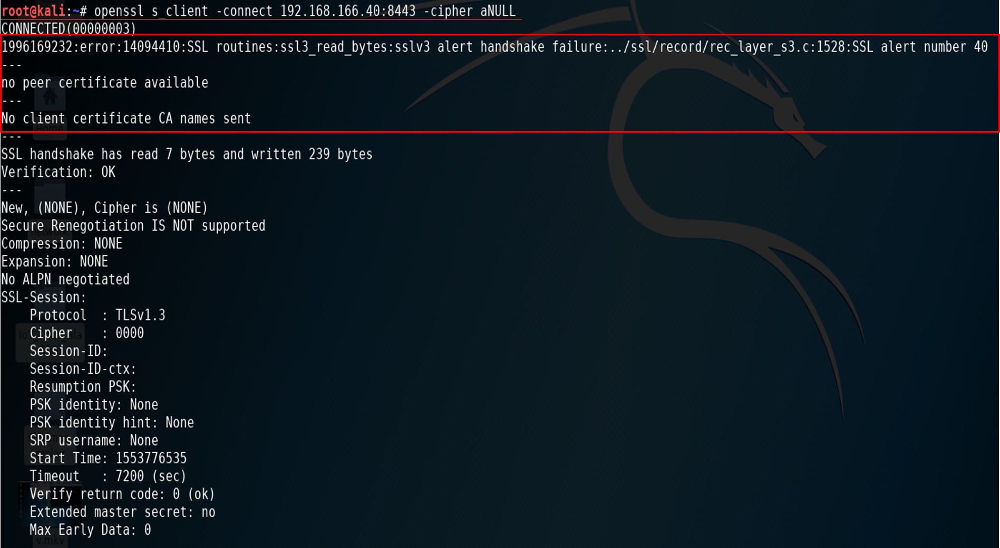

### Google Home Mini (GHM) Nmap scanning

Nmap scanning has been done for GHM to answer the below questions

1. Does GHM have open port?
2. What kind of ports are opened?
3. Is it vulnerable?

So, I turned on my laptop hotspot to connect GHM and then
I used Zenmap (7.70) which is GUI version of Nmap to see the ports.

I tested two types of protocol, UDP and TCP. I got the same open ports for both which are..

Out of those five ports, there were two interesting ports for me
They are 8009 and 8443 so I conducted some tests to see whether there were any vulnerabilities through the ports.

### _8009 port_

* Apache Tomcat 

As the 8009 port protocol is ajp13, it relates to Apache Tomcat.
To test the vulnerability of this port, I used Kali Linux and metasploit.

However, it didn't work. 

* axis2_deployer 

Tried another one. It is still msf but different command.

It failed.

### _8443 port_

8443 is Tomcat that opens SSL text service default port.
To test the vulnerability of this port, I used openssl_heartbleed, s_client command

* openssl_heartbleed

* nmap openssl

* s_client

These tests were also failed. There will be something else to check the vulnerability of the port but through these tests, I couldn't find any vulnerability ports.
