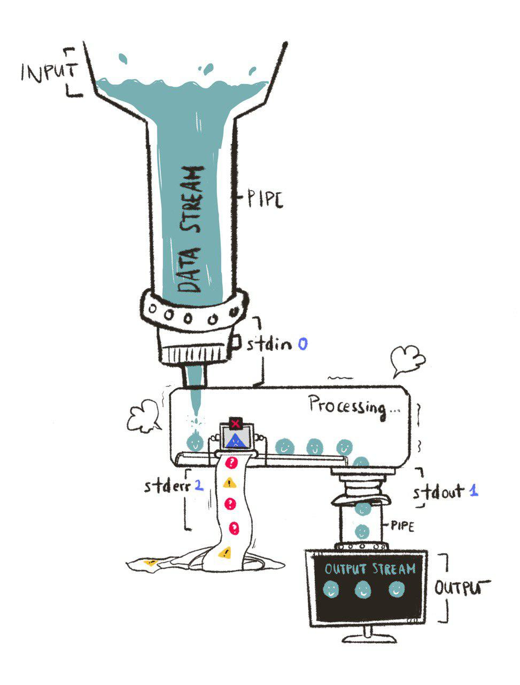
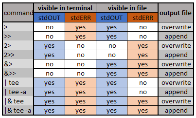

If you have worked with shell commands (e.g. ls, cd, dd ...) before, you probably have encountered a situation where you want to save the output on the terminal to a file. _Do I just take a screenshot?_ _Copy-paste?_ Of course, these are all possible solutions to the problem, but in this post I want to talk about controlling **Standard Streams** in Linux shell. 

Standard Streams are simply (input and output) data streams moving from one process to another via pipes. The three "standard" predefined streams available are:

* Standard input (stdin)
Stream data going into a program. Some commands like ls, dir do not need data stream input. The file-descriptor is 0.

* Standard output (stdout)
Stream data going out of the program. Some commands like mv does not produce data stream output. The file-descriptor is 1.

* Standard error (stderr)
Stream data of error messages (e.g. "Permission denied") or diagnostics. The file-descriptor is 2.

The entire process would look like this:

There are two data stream outputs in this process, stdout (the round things that are piped to the monitor) and stderr(the long, long list of errors and warnings). Sometimes you want both output, sometimes you want to save only one of them. Sometimes you want to see the output on the terminal, sometimes you want it to be silent. So how do we do that?

By using commands such as ">" or "tee" we can easily redirect the result of our commands. The ">" operator can be used for stdout, while "2>" can be used for stderr. Another common redirect method is using the "tee" command, which splits the output stream so it can be displayed _and_ saved as file.

A well summarized table of the possible commands and their output format can be found below.

_This is a recreated version of the answer in this post [here](https://askubuntu.com/questions/420981/how-do-i-save-terminal-output-to-a-file) by the user ByteCommander._

### References

STDIN man page:
http://man7.org/linux/man-pages/man3/stdin.3.html

Standard streams wikipedia:
https://en.wikipedia.org/wiki/Standard_streams#Standard_error_.28stderr.29

How do I save terminal output to a file:
https://askubuntu.com/questions/420981/how-do-i-save-terminal-output-to-a-file
